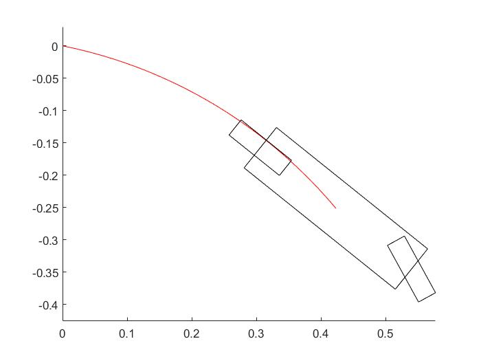

# spirit
spirit is a library to control a non-holonomic vehicle with a Model-based predictive controller

##Dependencies():
- Eigen3
- [Sophus](https://github.com/arpg/Sophus)
- [Pangolin](https://github.com/arpg/Pangolin)
- [SceneGraph](https://github.com/arpg/SceneGraph)
- [CarPlanner](https://github.com/arpg/CarPlanner)
- GLOG

##Applications
- ninja_gui : application to control our custom rc  car

## Other Instructions:
- TBD

## Bicycle Model notes
We would like to create a bicycle model which is kinematic and fixed to
a mesh, using a RK4 integrator rather than bullet. Here are some of the
notes for this.

The following images are from a MATLAB animation of the bicycle model. The
vehicle currently moves in a XY plane. A trajectory is drawn from the vehicles 
center of gravity.

